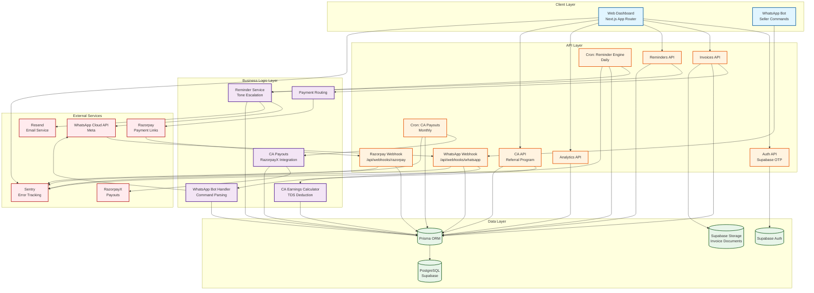

# UdhaarClear System Design Diagram

## Mermaid Diagram

## Data Flow Summary

### Invoice Creation Flow
1. Seller creates invoice via Web Dashboard or WhatsApp Bot command
2. Invoice stored in PostgreSQL via Prisma
3. Payment link generated via Razorpay
4. Reminder cadence scheduled (auto-reminder enabled)

### Payment Collection Flow
1. Buyer pays via Razorpay payment link
2. Razorpay sends webhook to `/api/webhooks/razorpay`
3. Webhook verified via HMAC-SHA256 signature
4. Idempotency check via `WebhookEvent` table
5. Invoice marked as PAID, reminders stopped
6. Confirmation sent via WhatsApp template + email

### Reminder Cadence Flow
1. Daily cron job queries unpaid invoices
2. Calculates days overdue, determines reminder phase
3. Sends reminder via WhatsApp template + email
4. Tone escalates: GENTLE → FIRM → LEGAL
5. Day 28: Human gate - requires seller approval for legal notice
6. All reminders logged to `Reminder` table

### CA Referral Flow
1. CA registers with ICAI verification (OTP to phone)
2. CA gets unique referral code
3. Business signs up via referral link
4. `Business.caId` permanently set (attribution lock)
5. Monthly cron calculates commission per (CA, client, month)
6. TDS deducted, aggregated into `CAPayout`
7. Payout triggered via RazorpayX NEFT

## Key Design Decisions

1. **Webhook Idempotency**: Database unique constraint on `(provider, eventId)` prevents duplicate processing
2. **Dual WhatsApp Integration**: Bot commands for sellers + template messages for automated reminders
3. **CA Attribution Lock**: `Business.caId` set once at signup, never updated for permanent commission attribution

## How to Convert to PNG

1. Install Mermaid CLI: `npm install -g @mermaid-js/mermaid-cli`
2. Convert: `mmdc -i system-design.md -o system-design.png -t neutral -b transparent`
3. Or use online tool: https://mermaid.live/
